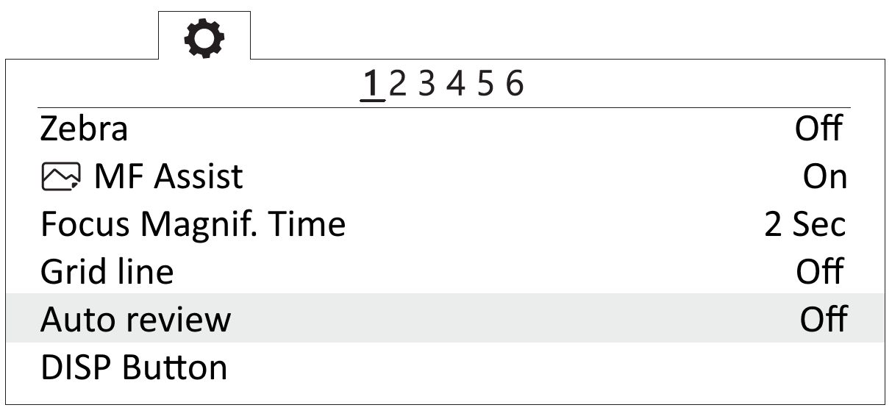

Camera settings
=========================

Sony DSC-RX1R II Settings
------------------------------------------

.. |icon_cam| image:: _static/_images/icon_cam.png
    :width: 25

.. |icon_key| image:: _static/_images/icon_key.png
    :width: 25

.. |icon_set| image:: _static/_images/icon_set.png
    :width: 25

.. |icon_bag| image:: _static/_images/icon_bag.png
    :width: 25

.. |icon_sd| image:: _static/_images/icon_sd.png
    :width: 25

Before changing any settings, carfully read `Camera Operating Instructions <https://www.sony.com/electronics/support/res/manuals/4469/44695771M.pdf>`_ to get information about functions and control elements.

* Set mode disc to **S** (Exposure priority).
* Set exposure **1/800**.
* Set exposure correction disc to **0** (Zero).
* Set macro to **0,3m-∞**.
* Set focusing mode disc to **MF**.

To set camera parameters, push **MENU** button, then select parameters according to the following instructions.

* In user settings menu |icon_set| (1 tab) turn off **Automatic preview**.

.. figure:: _static/_images/menu2.png
   :width: 400
   :align: center

   Turn off automatic preview

* Turn off **RF assist** and set **Extend focus time** - **No restrictions** (2 tab).

.. figure:: _static/_images/menu13.png
   :width: 400
   :align: center

   Turn off RF assist and focus time extend setting.

* Set **MOVIE** - **Video mode only** (3 tab).

.. figure:: _static/_images/menu11.png
   :width: 400
   :align: center

   Set video mode only

* In settings menu |icon_key| tab 2 set **Power saving time** - **30 min** .

.. figure:: _static/_images/menu1.png
   :width: 400
   :align: center

   Power saving time 

* In memory card menu |icon_sd| select**File №** - **Clear**.

.. figure:: _static/_images/menu3.png
   :width: 400
   :align: center

   Clear file number

Other settings should not be changed as they are used in default mode.

**SD Card Formating**

1) Select **MENU →** |icon_sd| **[Memory card]** **→ Format**

**All Settings Reset**

Follow these steps to set default settings:

1) Select **MENU** → **Settings menu** → **INITIALISATION** → **Reset**

.. attention::  Do not remove the battery during a reset process!

2) After camera reboot, you need to set **Timezone and date**, otherwise the settings will not be saved and this menu will appear at every turn on.

3) Use ON/OFF switcher to turn the camera off.
4) Wait 3 minutes for all settings to be saved (do not disconnect the battery or power cord).

.. important:: **«E:61:00»** error may appear on the screen, as the camera is focused to infinity. **This message will not interfere with camera's function**.

Sony A6000 Settings 
------------------------------------

Before changing camera's settings, read its the full operating instructions, which describes the purpose and use of the controls.

Set the mode dial to **S** (Shutter Priority).

Use the control wheel to set the following parameters:

.. csv-table:: 
   
   "Exposition", "1/800"
   "ISO", "Auto"

* In Photo menu (tab 2) set **Focus Mode** - *Manual focus*.

.. figure:: _static/_images/menu4.png
   :align: center
   :width: 400

   Focus Mode

* In Custom settings menu (tab 1) disable **Automatic preview**.

   Automatic preview off

* In Custom settings menu (tab 3) turn on **Lens-less Shutter**.

.. figure:: _static/_images/menu6.png
   :align: center
   :width: 400

   Turn on the shutter without a lens

* In Custom Settings menu (tab 6) set the **MOVIE** button - **Video mode only**.

.. figure:: _static/_images/menu7.png
   :align: center
   :width: 400

   Set "Video Mode Only"

* In menu (tab 2) set **Start time energy saving** - **30 min**.

   Set the time to start energy saving

* In menu (tab 5) set **File Number** - **Reset**.

   Reset file number

Sony A6000 NIR Settings
----------------------------------

The following options are set in Photo menu:

* **Quality** - **RAW** in Photo menu (Tab 1)

   Set the quality

* **ISO** up to 400 (press the control wheel to the right to select);

* **Exposure compensation** from EV **+1** to EV **+2** (press the control wheel down to select).

Camera offsets
----------------------------------

To compensate the difference between the center of camera sensor and GPS receiver antenna, input the following offsets in photogrammetry software before executing the processing.

   Geoscan 201 offsets

Offset values for left camera slot:

+---------------+-------+-------+-------+
| Camera, angle | x     | y     | z     |
+===============+=======+=======+=======+
| A6000, nadir  | 0.506 | 0.180 | 0.033 |
+---------------+-------+-------+-------+
| RX-1, 15°     | 0.504 | 0.181 | 0.033 |
+---------------+-------+-------+-------+
| RX-1, 20°     | 0.505 | 0.175 | 0.026 |
+---------------+-------+-------+-------+
| Silar         | 0.506 | 0.179 | 0.006 |
+---------------+-------+-------+-------+

Offset values for right camera slot:

+---------------+-------+-------+-------+
| Camera, angle | X     | Y     | Z     |
+===============+=======+=======+=======+
| A6000, nadir  | 0.374 | 0.179 | 0.04  |
+---------------+-------+-------+-------+
| RX-1, 15°     | 0.357 | 0.181 | 0.033 |
+---------------+-------+-------+-------+
| RX-1, nadir   | 0.368 | 0.181 | 0.032 |
+---------------+-------+-------+-------+

Offsets for RX-1 camera, mounted at central slot:

+---------------+-------+-------+-------+
| Camera, angle | X     | Y     | Z     |
+===============+=======+=======+=======+
| RX-1, nadir   | 0.489 | 0.175 | 0.032 |
+---------------+-------+-------+-------+

offsets for RedEdge-MX multilens camera in left slot:

+----------+-------+-------+-------+
| Lens     | X     | Y     | Z     |
+==========+=======+=======+=======+
| Blue     | 0.480 | 0.188 | 0.006 |
+----------+-------+-------+-------+
| Green    | 0.509 | 0.189 | 0.006 |
+----------+-------+-------+-------+
| Red      | 0.509 | 0.167 | 0.006 |
+----------+-------+-------+-------+
| NIR      | 0.480 | 0.167 | 0.006 |
+----------+-------+-------+-------+
| Red Edge | 0.495 | 0.177 | 0.006 |
+----------+-------+-------+-------+

In Agisoft Metashape, select **Camera calibration** in **Instruments** tab. Input offsets from the table above in **GPS/INS offset** tab. Note that X coordinate offset is with **+**, while  Y and Z are with **-**. 

