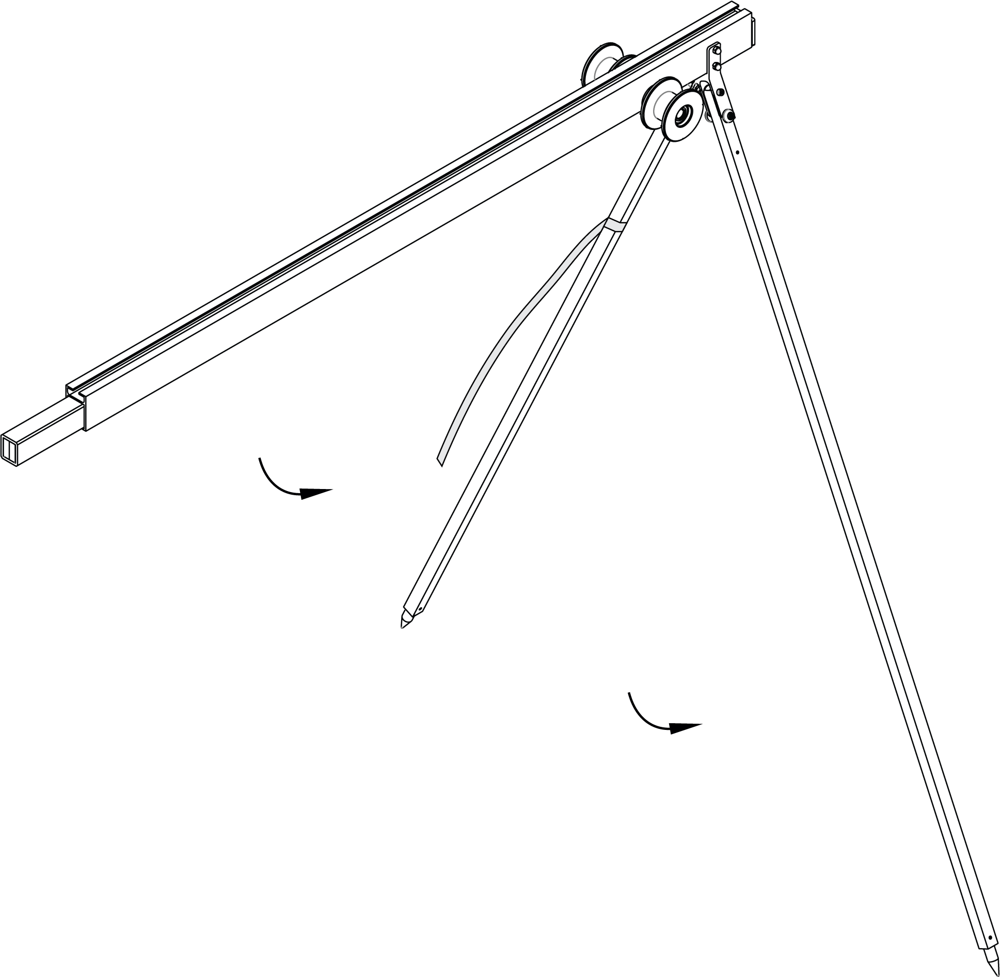
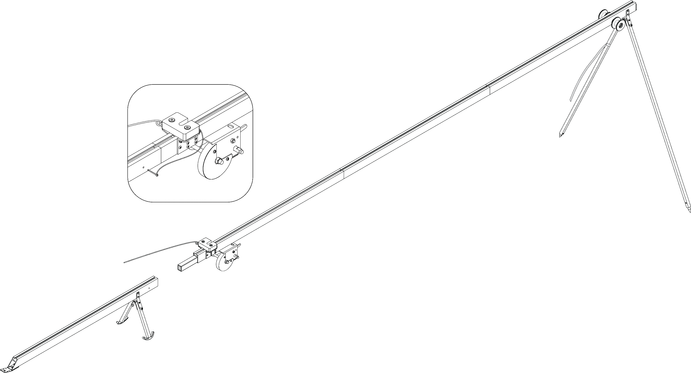

Launcher
=====================

Launcher is used for accelerating the UAV to the speed which makes stabilized flight possible.

Kit
---------------------------------

Assembly
----------

Take out parts of the launcher from the transport bag.

   Unfold the front supports of the launcher. Make sure that they are securely locked. To fold the supports, pull the locking nuts down.

.. figure:: _static/_images/catapult2.png
   :align: center
   :width: 400

   Attach the middle section of the launcher.

.. figure:: _static/_images/catapult3.png
   :align: center
   :width: 400

   Attach the middle section of the launcher with the winding mechanism

.. figure:: _static/_images/catapult4.png
   :align: center
   :width: 400

   Unfold the supports of a luncher's rear section.

   Attach the rear section to the rest of the launcher. Insert the locking pin to secure the rear and middle part together.

.. attention:: UAV can be launched ONLY against the wind direction. Otherwise, it can cause crash or obstacle collision. When the wind is not blowing at all, add extra coil of rubber bands from the repair kit on each side of the launcher.

* Install the launcher on a level surface so that the launch would happen against the wind direction.

* Make sure the launcher stands securely with no pitch to any side. If necessary, push one of the supports in the ground to level it.

* Install and hammer the stop peg into the bracket at the rear part of the launcher. This prevents launcher displacement at UAV start.

.. attention:: The stop peg must be hammered to avoid the launcher jumping at the start of the UAV. Make sure the rear part of the launcher does not get deformed when you hammer on the peg.

.. figure:: _static/_images/catapult9.png
   :align: center
   :width: 400

   Install the carriage onto the guide of the launcher, so that it could slide along launcher rails.

* Move the carriage down until it locks in the rear (you should hear 2 clicks)

.. note:: Before every launch, make sure that the carriage slides on the rails without clinging..

.. figure:: _static/_images/catapult8.png
   :align: center
   :width: 400

   Insert the safety pin into the launch mechanism. Release the winch stopper and unwind the tension cable.

* Take the rubber bands and straighten them. Make sure that the cords are not overlapped.

 
.. figure:: _static/_images/catapult10.png
   :align: center
   :width: 250

   Fold the rubber bands in a way that puts carabiner to one side and synthetic line ring on the other. Make a loop from this line and hook it to the carriage. 

* Connect the other end of a rubber band to the winding line with a carabiner. The winding line must pass through the roller. The carbine must be clutched.

* Attach the next rubber band in a same way.

.. figure:: _static/_images/catapult11.png
   :align: center
   :width: 400

   Install the winch reel handle.

Pre-launch sequence
-----------------------

.. attention:: In order to ensure the safety of the launch pad and increase the of rubber cords lifetime, do not leave them armed for more than 2-3 minutes before launch.

Switch the winch stopper to cable tension position. Pull the rubber cords back by rotating the winch reel handle. In case of contact with the cords between the roller and the guide part of the launcher or break from the roller, it is necessary to stop the tension of the cords. Displaced bands should be placed on the roller, after which you can continue to pull the cords of the launcher.

You must stop the cords tesion when carbines as soon as carabiner reaches "STOP" marker, engraved on the middle part of the launcher.

Now you can place UAV on the launcher.

.. attention:: Make sure the rubber band folds the propeller, and its blades are in horizontal plane. 

Rubber cords condition rules
----------------------------------------

* Check the condition of the rubber cords regularly. If cracks and scuffs appear, replace the damaged ring with a spare ring from the spare parts kit.
* Don't keep the rubber cords stretched for a long time. Stretch the cords just before placing the UAV on the launcher.
* During  warm season, do not allow long-term exposure of rubber cords in direct sunlight.
* During cold season, do not allow the rubber cords to freeze. Keep them in a warm place prior to installation and arm before the launch. After UAV liftoff, immediately remove the cords from the launcher and put them to a warm place.
  
