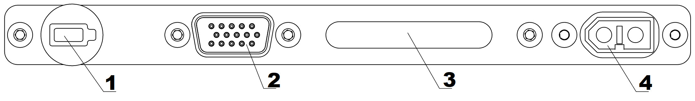

Charger and Battery
=========================

.. csv-table:: **Battery specifications**
   
   "Guaranteed number of charge-discharge cycles", "80"
   "Recommended charge current", "10 A"
   "Max voltage", "21 V"
   "Operating voltage", "18,5 V"
   "Min voltage", "15 V"
   "Discharging current", "68 A"
   "Number of cells", "5"
   "Capacity", "34 000 mA×h"
   "Service life", "1 year"

Safety rules
----------------------

**Battery**

* Do not disassemble the battery.
* Do not use other charging stations or cables to charge the battery.
* Do not connect the battery to the charging station while it is turned off.
* Do not transport the battery inside the UAV (only in GCS protective case)
* Do not leave the battery in direct sunlight. 
* Do not store or transport the battery at temperatures below +3 °С.

.. warning:: Never shortcut the battery's contacts.

**Charger**

* Turn on the charger and select *LiPo* mode before connecting it to the battery. 

* Carefully examine cables and connectors for damage signs before every use.

* Do not use the charger in direct sunlight.

* Do not leave active charger unattended.

Battery charger preset
----------------------------------------------------
The charger is set at the manufacturer's. To reset it, follow these steps:

* on PROGRAM SELECT screen (main) press **Batt type/Stop** button multiple times, until there will be **Settings** icon shown on the screen;

* to confirm, press **Start/Enter** button once.

Use **Dec/Inc** buttons to navigate through the settings menu;

Steps you should complete in Settings menu:

* Turn charging time limit off by selecting **Safety timer** screen with **Dec/Inc** buttons.

After pressing the **Start/Enter** button, ON/OFF function will be available. Use **Dec/Inc**  to select OFF, then press **Start/Enter** until settings stop flashing on the screen.

* Turn battery capacity limit using **Dec/Inc** buttons to select the Capacity cut-off screen. 

Press **Start/Enter** button to activate the ON/OFF function, then use **Dec/Inc** button to set parameter to OFF, and press **Start/Enter** until settings stop flashing on the screen.

Press **Batt type/Stop** button to exit the settings menu.

* On PROGRAM SELECT screen (main), use **Dec/Inc** button to select Lithium battery and confirm it with single press of **Start/Enter** button, then select following:

"AUTO" parameter defines the number of battery cells (S). It is not recommended to change other parameters.

Battery connection
-----------------------------------------------------

1) Connect the balance cable to the battery.
2) Connect the power cable to the battery.

.. Attention:: 
 It is possible to use car or truck 12V battery as a power source for the charger, but the engine must be running to prevent the battery from complete discharge. 

Recommendations for lithium polymer (LiPo) battery use
------------------------------------------------------

Battery indication board
-----------------------------

+--------------------+-------------------+----------------+-----------------+
|                     Battery controls and indicators                       |
+====================+===================+================+=================+
| 1                  | 2                 | 3              | 4               |
+--------------------+-------------------+----------------+-----------------+
| control button     | balance connector | LED indicators | power connector |
+--------------------+-------------------+----------------+-----------------+

Press control button (1), to get battery status. LED indicators (3) will show charge level with green sections. After that, red sections will indicate internal temperature. 

.. csv-table:: **Battery temperature indicators**
   :header: "Number of LEDs", "mode", "Temperature, С"
   

   "I", "blink", "< 5"
   "II", "blink", "5-10"
   "III", "blink", "10-15"
   "IIII", "shine", "15-20"
   "IIIII", "shine", "20-25"
   "IIIIII", "shine", "25-30"
   "IIIIIII", "blink", "30-35"
   "IIIIIIII", "blink", "35-40"
   "IIIIIIIII", "blink", "40-45"
   "IIIIIIIIII", "blink", ">=45"

After that, the LED bar will turn yellow and sections start to go out one by one. During this time, you can set the battery to internal heating mode ( if this is an Arctic kit), or connect it to the UAV to power its electronics.

.. Attention:: 
 DO NOT connect external power unit to the battery while it is in indication mode.

.. csv-table:: **Key battery charge levels**
   :header: "Battery", "Charged", "Half charge", "close to discharge", "discharged", "power loss, battery malfunction"

   "5S", "21,0 V", "18.5,0 V", "16.5,0 V", "15,0 V", ">15,0 V"

Battery discharge speed depends on throttle level, which changes due to weather conditions and flight route. When creating the polygon, it is best to make it rectangular with minimum amount of turns and long straights. This way you will increase the flight efficiency. 

.. Attention:: 
 After battery charge level drops down under 18 Volts, the battery will discharge faster

Battery heating mode control (for "Arctic" kit)
-------------------------------------------------

Arctic batteries mod can be identified by snowflake pictogram on its hull. Such batteries can be used at -40 °C до +20 °C temperature conditions.

To activate the self-heating mode, press and hold control button (1) for more than 2 seconds in indication mode. LED bar will turn orange and now will be showing heating time left (every section is 3 minutes, 30 minutes total). Another long press and hold of the button will turn heating mode off.

.. csv-table:: **Индикация оставшегося времени поддержания температуры АКБ**
   :header: "LEDs", "Remaining time, minutes"
   

   "I", "3"
   "II", "6"
   "III", "9"
   "IIII", "12"
   "IIIII", "15"
   "IIIIII", "18"
   "IIIIIII", "21"
   "IIIIIIII", "24"
   "IIIIIIIII", "27"
   "IIIIIIIIII", "30"
 
 
   The operating temperature maintenance mode is activated automatically when an external heating source (car battery, for example) is connected to the balancing connector of the battery using a cable from kit. The status LED will light up orange and the battery will activate the temperature maintenance mode for 30 minutes. To activate the mode again, disconnect and re-insert the cable to the balancing connector of the battery. 
 
 | We recommended to keep the car engine turned on to avoid discharge car battery.

Recommendations for charger and battery use
------------------------------------------------------

* If the flights are performed at temperatures below 0 degrees, the battery must be stored in a warm place before the flight and avoid being cooled. It should be remembered that lithium polymer batteries can lose up to 30% of its capacity in cold conditions, this fact must be taken into account when preparing the flight task;
* If the flights are performed at temperatures above 25 degrees, the battery must be stored in a cool place, protected from direct sunlight before the flight. After the flight, you can not immediately charge the battery, you need to let it cool down. It is also necessary to charge in a cool place, protected from direct sunlight.

* Charge the battery after every use.
* Do not overcharge or over discharge the battery. Every cell's voltage should be in range between 3.3 - 4.2 V (optimal level - 3.7 В). For Geoscan 201 5S battery overall voltage at power connector should be between 16.5 and 21 V.
* Do not charge the battery in cold if it will be then moved to a warm place. Heating of a fully charged battery may cause decline in its lifetime and even inflamation. 
* Do not store the battery in completely charged or discharged state. Optimal charge level for storage is 50%. It is sufficient to prevent battery from daage for 5-6 months. Storage room should be dry, with no direct sunlight and temperatures from 5 to 25 °С and humidity less than 80%. Optimal storage, charging and usage temperature is +15 °С. 
* Lithium battery are influenced by aging. Its intensity depends on time, storage and usage temperatures, number of charge-discharge cycles. 
* Storage time - 1 year. After that, the battery should be fully discharged and than charged again. 

Battery recycling
----------------------

.. attention:: Do not throw LiPo batteries out to any garbage container. Wrong recycling may be dangerous for the environment. Utilize the batteries according to the legislation rules and norms by recycling it safely.

