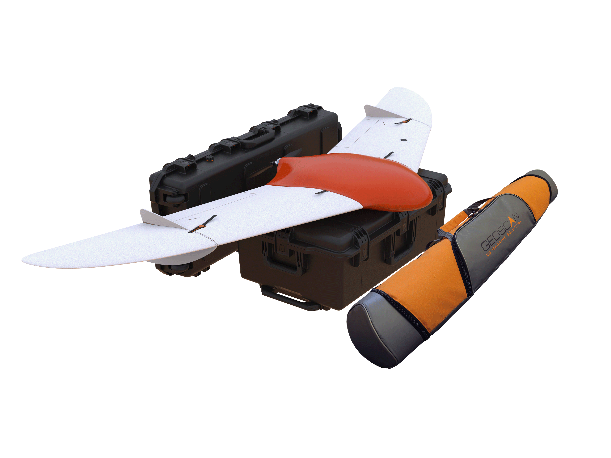

.. 201-doc documentation master file, created by
   sphinx-quickstart on Fri Dec 21 11:13:03 2018.
   You can adapt this file completely to your liking, but it should at least
   contain the root `toctree` directive.

Geoscan 201 Instruction Manual
===================================

General Information
----------------------

Geoscan 201 is an aerial photo system which consists unmanned aerial vehicle (UAV), launcher and flight planning software.

Application
_________________

The system is designed for geolinked photography of objects and territories.

**Fields of application**

Obtained data can be used for:

* orthophoto creation with scale of 1:500 — 1:2000;
* 3D terrain modeling;
* altitude map generation; 
* volumetric calculations for quarries and fills;
* infrastructural objects examine;
* forest and fields mapping;
* damage control and emergency response (floods, earthquakes, wildfires).

.. csv-table:: **Specifications**

   "UAV type", "fixed wing"
   "Airspeed", "64 — 130 km/h"
   "Max takeoff weight", "8,5 kg"
   "Max payload", "1,5 kg"
   "Photographed area","7 — 22 km²"
   "Max wind speed","12 m/s"
   "Wingspan", "2,22 m"
   "Min safe altitude","100 m"
   "Max flight altitude","4000 m"
   "Motor","electric brushless"
   "Battery","LiPo 18,5 V"
   "Preparation time","10 min"
   "Flight duration", "up to 180 min"
   "Max flight distance","210 km"
   "Takeoff mechanism","catapult"
   "Landing","automatic parachute"
   "Operating temperature range:",""
   "  Default battery","from -20 to +40 °С"
   "  Arctic battery","from -40 to +20 °С"

Kit
______________

* Geoscan 201 UAV 
* Radio modem
* Modem pole
* Battery charger
* Launcher in transport bag 
* UAV transport container
* Backpack
* Folding rack for UAV assembly
* Fuselage holder
* Spare parts
* Documentation
* Topcon B111 GNSS reciver `*`
* Payload: `*`

   *  Sony DSC-RX1RM2;
   *  Sony A6000;
   *  Sony A6000 NIR;
   *  MicaSense RedEdge-MX.

`*` — depends on exact kit ordered

Maintenance 
__________________

Examine the UAV for any damage after each flight.

In case of propeller blades or fin damages, you can easily replace them yourself, using spare blades.

In case of UAV body or any system damage it is necessary to contact `Geoscan support`_

.. _Geoscan support: https://www.geoscan.aero/en/support

After every 80 flights it is recommended to send the UAV to the manufacturer for check and service. 

Storage
_______________

Geoscan 201 is stored with battery apart in transport case. The launcher is to be stored in its own bag. The storage place should be dry with temperature from +5 to 25 °С and relative humidity no more then 80% with no condensate. UAV service life — 2 years.

Battery should be stored in dry cool place with no direct sunlight at temperatures from +5 to 25 °С and relative humidity no more then 80% with no condensate. Optimal temperature from +5 to 10 °С. Optimal storage charge level should be close to 19 V (see **Charger and Battery** section for details).
Battery service life — 1 year.

.. toctree::
   :maxdepth: 2
   :hidden:
   :caption: Contents

   reference
   precautions
   uav
   nsu
   catapult
   camera
   charger
   planner
   launch

