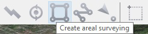
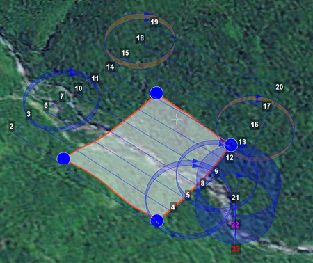
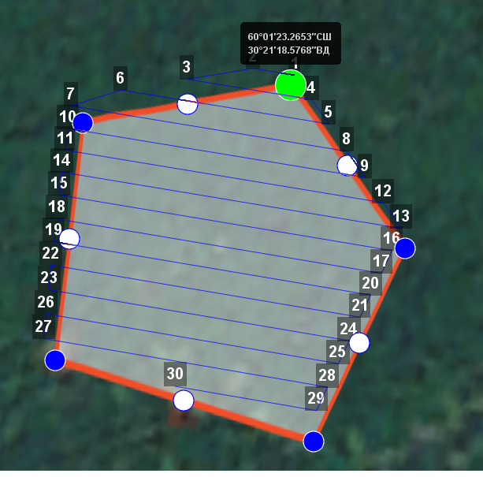
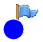
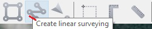
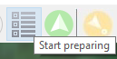

Geoscan Planner
==============================

Preset
-----------------------------------

1) Connect radio modem to laptop.
2) Turn UAV power on.
3) Run **MdmDisp** application.

In the lower right corner of the screen, the antenna icon and the number of connected aircrafts are displayed.

.. figure:: _static/_images/planner1.png
   :align: center
   :width: 100

   MdmDisp program indicator

3.1 The first turn on, you need to configure connection with UAV. 

Run **NetTopology**:

* Click on the **Search new devices** icon .

   Search icon

The program shows a list of detected modems.

.. note:: The icon is fixable, so it should be pressed again to stop searching.

* Choose UAV №xxx and click on the **Add device** icon.

   Add device

The program saves the list of added devices.

Run **MdmDisp** and make sure that the connection is successful.

If UAV is not detected, you can reconnect the RCL modem by clicking **Reconnect** in context menu.

   Context menu MdmDisp

4) Run program **Geoscan Planner**.
5) Enter your login and password.
6) For UAV connection, select the drop-down menu **Flight – Connect to the UAV – Search...**.

   Connect UAV

7) Select type of connection **MdmDisp**. Set **IP-address** *localhost*. In **Vehicle** list set **UAV - Port 6**.

   Connect UAV

.. note:: It is enough to set the parameters once. Next time when you connect your UAV, click **Connect the UAV** on the toolbar. The receiver will automatically detect the coordinates and display the UAV location on the map. The telemetry panel (left) and the instrument panel (right) appear in the program window.

   Connect to the UAV

Creating a flight task
----------------------------------------

1) Create **New project**.

   New project creation

2) Set project name, shooting parameters, UAV and camera.

   Project parameters

Areal surveying
-------------------------------------------

Areal surveying is an aerial photography of polygons. The operator sets the vertices of the polygon, and the program automatically calculates the route for UAV.

1) Click on the icon **Create areal surveying** on the toolbar.

   Areal surveying creation

2) By single mouse clicking specify the angular points of the research site. The program automatically calculates the route for bypassing the polygon.
It is enough for the operator to create a polygon directly along the boundaries of the investigated area, the program will increase the length of the overfights and their number in accordance with the survey conditions by itself.
When creating a route, UAV climb and descent is displayed as the cylinders if the difference in heights of neighboring points is not less than 30 meters.

   Climb and descent cylinders

Adding and removing polygon vertices
__________________________________________

You can add vertices to the completed polygon.

1) Hold the left mouse button and move the middle point of the polygon side.

.. figure:: _static/_images/planner10.png
   :align: center
   :width: 500

   Adding the vertex

The vertex will be created automatically.
In a floating window near the vertex will display its coordinates.

   Result of adding a vertex

To remove vertex:

1) Click right button on vertex.
2) In menu select **Delete vertex**.

.. figure:: _static/_images/planner33.png
   :align: center
   :width: 500

   Delete vertex

Changing the direction of the route lines
_____________________________________________

The necessity of optimizing polygon "by direction" occurs quite often, for example, if the force and direction of the wind are unfavorable at the site of work (strong wind along the lines of the overflight above the polygon).
To change the type of optimization, right-click on the polygon and select the option **Optimization by “direction”** in the context menu.

1) Right-click on the polygon area.
2) Select **Optimization by “direction”**.

   Optimization by direction

One of the vertices of the polygon will be highlighted and a rotation marker will appear on it to set the direction.

   Adjusting the direction of flight

As a Result, there will be a new route to fly around the area in the specified direction.

   New flight route

Change entry point
_________________________________

To change the polygon entry point, follow these steps:

1) Select polygon

   Selected polygon

2) Right-click to select the point where you want to start circling the area.
3) In menu select **Make start point here**.

   Change the polygon entry point

A marker |flag| appears at the selected entry point.

Linear surveying
---------------------------
Linear aerial photography is performed in order to survey linear extended objects, such as: rivers, roads, power lines, oil pipelines.

1) Click on the icon **Create linear surveying** on the toolbar.

   Linear surveying creation

2) Single-click to specify the route of traversing the extended object by turning points. The program will automatically draw lines of flight.

.. figure:: _static/_images/planner17.png
   :align: center
   :width: 500

   Example of linear surveying

Hop
----------------
Fight by pre-set route with a set altitude. It is mainly used for passing above point objects (i.e. high objects) and topographic inequality.

1) Click on the icon **Create hop** on the toolbar.

   Hop creation

2) Specify the flight route by single-clicking. To build a hop at different altitudes, select **Optimization - Custom altitude** in “Properties” window.

   Hop creation

**Non zero photo step** function activates the camera.

You can change the step of photo in meters is specified in the corresponding field.
Values of the Alt. AGL column are the differences between the absolute height of the flight task point and the relief below it. Thus, the height of the relief must be taken into account. The absolute heights of the points are also available for editing through the column Alt. WGS84. Besides, height can be changed by visual editing (drag mouse with Shift key pressed).

Hop route between two flight elements is built according to the following rules: 

1) If the flight elements have the same height, then the flight will be performed at the same height.
2) If the fight elements have different heights, then the flight will be performed at the highest of them.

.. attention:: If conditions do not allow to reach the height of the second point by a straight trajectory (for example, due to small distance between points, but a large difference in altitude), the aircraft will fly with the maximum allowable pitch by a straight trajectory in order to reach a point by the coordinates, after which it will rise/descend in a spiral.

Waiting point
------------------------
Waiting point serves to hold the indicated point at the specified altitude during the specified time interval. Also, waiting point allows to measure the direction and force of the wind at a specified altitude.

1) Click **Create waiting point** icon on the toolbar.

   Waiting point creation

2) Click and specify the point, where a waiting should take place.

In expert mode properties may be changed: setting an altitude of the waiting point, the waiting time and activation of the wind measurement function.

   Waiting point options

The UAV will hold the point for the specified time (300 seconds by default) at the specified height, and then go along the planned route.

When ** Wind measure ** is activated, the duration is automatically set to 0. The last point will turn yellow. The UAV flies in a circle, taking into account wind measurements.

   The point of wind measurement

Infinite waiting

   Point of infinite waiting

.. attention:: It is recommended to set a point of waiting with the wind measurement before each flight element at an altitude of the flight element. Taking into account the wind measurement data, UAV will go smoother along the route.

Landing route
--------------------------------
Command **Create landing point** is used to make a landing route.

Building a landing route is an indispensable action at the stage of preparing a flight task.

On arrival at the survey area, determine the wind direction, correct the zone of fight (if necessary) and select the landing site.
For landing site, choose a open field or meadow without water, trees and other obstacles.

1) Click **Create landing point** icon on the toolbar.

   Landing route creation

2) By single-clicking select the landing point first, and then the point of landing approach.

Program automatically creates the landing route, which consists of 3 points (the middle point is created automatically).

.. figure:: _static/_images/planner32.png
   :align: center
   :width: 500

   Example of landing

.. attention:: It is necessary that the landing is being performed against the wind. Otherwise, a hard landing is possible, leading to the aircraft damaging.

Pre-launch preparation
----------------------------

1) Launch **Start preparing**.

   Start preparing Wizard launch

Follow the instructions of the Start preparing Wizard (most tests are runned automatically).
Set the radius of the automatic parachute detaching and autonomous flight time (time in flight without the connection between the GCS and UAV).
After fight preparation is complete, place UAV on the launcher.

.. attention:: The return height must be  must ensure that there are no barriers on the flight route.

Flight
----------------------------

1) Click **Start** the icon.

   Start

The telemetry panel displays **CATAPULT** mode.

   CATAPULT mode

.. attention:: It is necessary to switch the UAV to a start mode only after placing it on the launcher. It is forbidden to take and move the UAV after switching to **CATAPULT** mode.

.. attention:: To cancel the switching to Catapult mode, press **Cancel**. UAV will be switched to the **Preparation** mode. It will require to go through the flight preparation again.

2) Turn the safety off and activate the launch device, pulling the launching cord.

UAV will take off.

.. note:: See more information in `Launch`_ section.

Действия при отказах
----------------------

При возникновении отказа на панели телеметрии в графе Отказы отобразится сообщение о типе ошибки. Ниже представлена таблица возможных сообщений панели и действия по устранению проблем.

.. csv-table:: 
   :header: "Failture", "Description", "Actions"
   :widths: 7, 15, 20

    "AIRSTART", "An unscheduled autopilot reboot occurred", "Осуществите немедленную посадку. Свяжитесь со службой поддержки"
    "GNSS_ERROR", "Satellite receiver error", "Обновите лицензию. Свяжитесь со службой поддержки "
    "ACCEL_ERROR", "UAV  Orientation  system  error, data from the accelerometer is not received", "Подключитесь к интернету для обновления файла зон. Свяжитесь со службой поддержки "
    "EEPROM_ERROR", "Error  of  reading  or  writing non energy-based memory", "Подключитесь к интернету для обновления файла зон. Свяжитесь со службой поддержки "
    "LINK_ERROR", "Link error: for a long timeautopilot did not receive messages from the ground controlstation", "Перепройдите предстартовую подготовку. Свяжитесь со службой поддержки "
    "PHOTO_ERROR", "An   error   of   photographing occured", "Обновите лицензию. Свяжитесь со службой поддержки "
    "GYRO_ERROR", "UAV  orientation  system  error, data from the gyroscopeis not received", "Происходит отключение фотокамеры, БВС выполняет полет к месту посадки "
    "ALT_ERROR", "UAV    height    measurementsensor  error,  data  from  thebarometer is not received", "Дождитесь инициализации автопилота "
    "NOT_READY", "UAV  is  not  ready  to  change its status", "Свяжитесь со службой поддержки"
    "HPGNSS_ERROR", "High-precision receiver error", "Подключитесь к интернету для обновления файла зон. Свяжитесь со службой поддержки"
    "LOGGER_ERROR", "Flight log recording error", "Подключитесь к интернету для обновления файла зон. Свяжитесь со службой поддержки"
    "FLASH_ERROR", "Отсутствует связь с двигателем", "Свяжитесь со службой поддержки"
    "MAG_ERROR", "Отсутствует синхронизация внутреннего времени автопилота со временем от спутникового приемника", "Дождитесь синхронизации"
    "AS_ERROR", "Ошибка системы ориентации БВС, не приходят данные с акселерометра", "Свяжитесь со службой поддержки "
    "NO_GNSS_TIME", "Ошибка датчика измерения высоты, не приходят данные с барометра", "Свяжитесь со службой поддержки "
    "ОШИБКА ГНСС ", "Ошибка приемника спутниковой навигации", "Перевключите БВС"
    "ОШИБКА ГИРОСКОПА ", "Ошибка системы ориентации БВС, не приходят данные с гироскопа", "Свяжитесь со службой поддержки "
    "ОШИБКА EEPROM ", "Ошибка чтения или записи энергонезависимой памяти", "Свяжитесь со службой поддержки "
    "ОШИБКА КАРТЫ ", "Ошибка внешнего постоянного хранилища данных: не удалось инициализировать внешнюю карту памяти", "Проверьте карту памяти"
    "ОШИБКА КОМПАСА ", "Ошибка датчика определения направления, не приходят данные с магнитометра", "Осуществите немедленную посадку"
    "ОШИБКА КРЛ ", "Ошибка канала связи: автопилот в течение длительного времени не получал сообщений от наземной станции управления", "Проверьте бортовой модем после возвращения борта "
    "ОШИБКА ЛИЦЕНЗИИ ", "Ошибка проверки лицензии на полет", "Попробуйте перезагрузить файл лицензии. Свяжитесь со службой поддержки"
    "ОШИБКА ЛОГГЕРА ", "Ошибка записи полетного лога", "Проверьте карту памяти автопилота"
    "ОШИБКА НАСТРОЙКИ ", "Ошибка в параметрах автопилота", "Свяжитесь со службой поддержки" 
    "ОШИБКА ПЗ ", "Ошибка выполнения загруженного полетного задания", "Попробуйте обновить полетное задание. Свяжитесь со службой поддержки"
    "ОШИБКА ПИТАНИЯ ", "Ошибка питания автопилота", "Перевключите БВС "
    "ОШИБКА ФОТО ", "Произошла ошибка фотографирования", "Перевключите фотокамеру/проверьте флеш-карту фотокамеры"
    "ПЕРЕЗАГРУЗКА ", "Произошла внеплановая перезагрузка автопилота", "Свяжитесь со службой поддержки"
    "ФОТО: НЕТ КАРТЫ ", "Отсутствует карта памяти", "Вставьте карту в фотокамеру"
    "ФОТО: ОШИБКА КАРТЫ ", "Ошибка чтения/записи карты памяти", "Снимите защиту карты от записи"
    "ФОТО: ОШИБКА ПИТ ", "Напряжение питания фотоаппарата слишком высокое", "Перевключите БВС"
    "ФОТО: НИЗКОЕ НАПРЯЖЕНИЕ ", "Напряжение питания фотоаппарата слишком низкое", "Перевключите БВС"
    "ФОТО: ОШИБКА СИНХ ", "Потеря сигнала синхронизации времени", "Перевключите БВС"
    "ФОТО: ТЕМПЕРАТУРА ", "Фотокамера перегрета или переохлаждена", "Поместите фотокамеру в условия комнатной температуры"

Если предложенный вариант действий при отказе не помогает исправить ситуацию, незамедлительно свяжитесь со службой поддержки.

.. _`Launch`: launch.html