UAV
============

Parts and functions 
---------------------------

Complete set for UAV assemble:

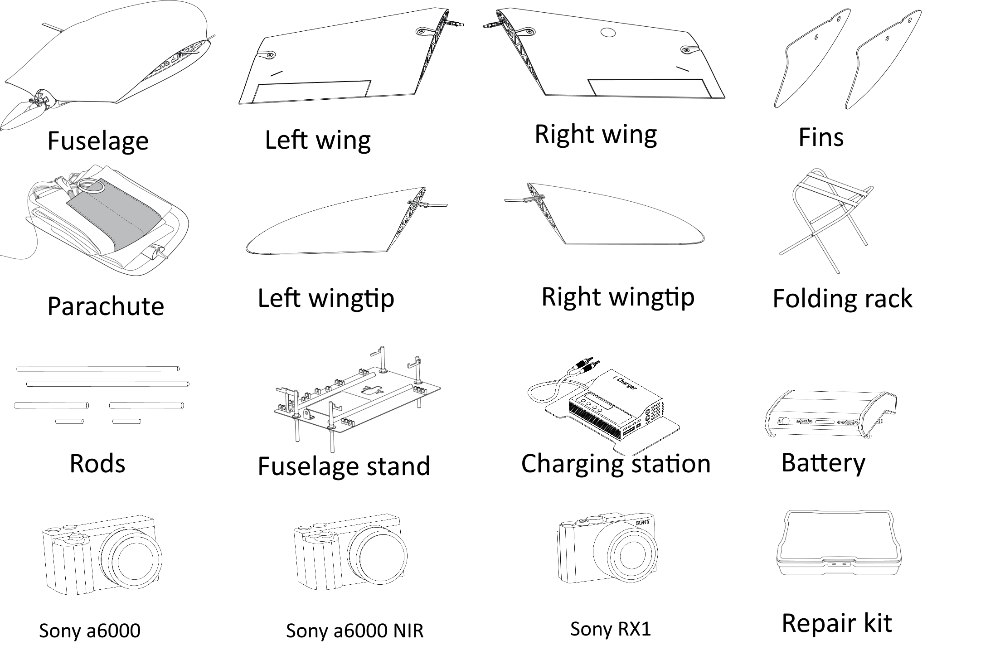

Assembly
-----------------------

Open transport case, take out the folding, and set it on a level surface. Take out the fuselage stand and set it on the same surface. Place the fuselage onto the folding rack. 

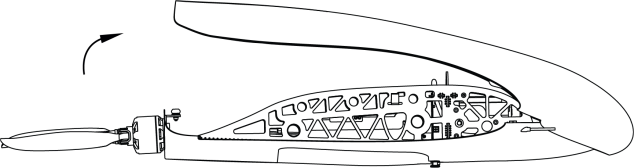

   Remove the top cover by moving the pin, as shown in the picture.

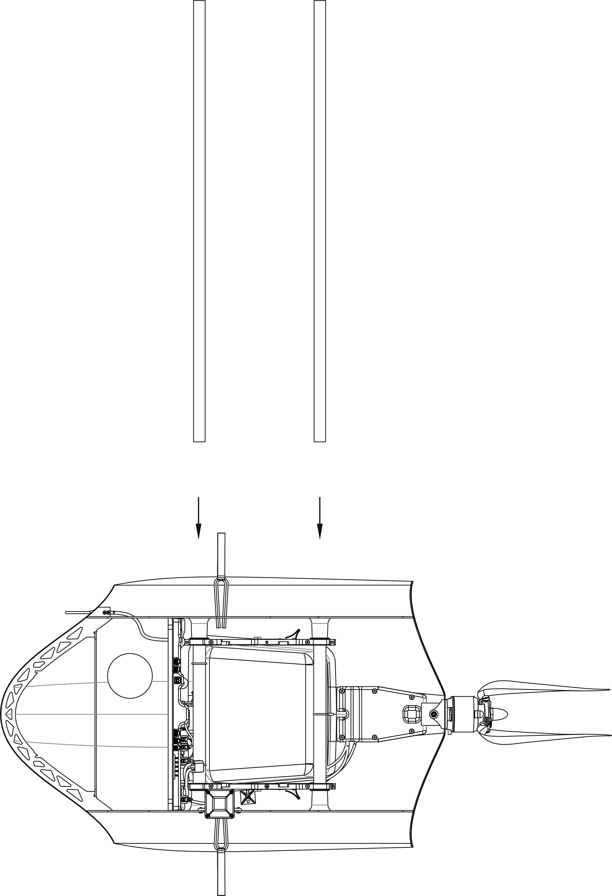
   
   Take the longer mounting rods from the case and insert them in its places in the fuselage. 

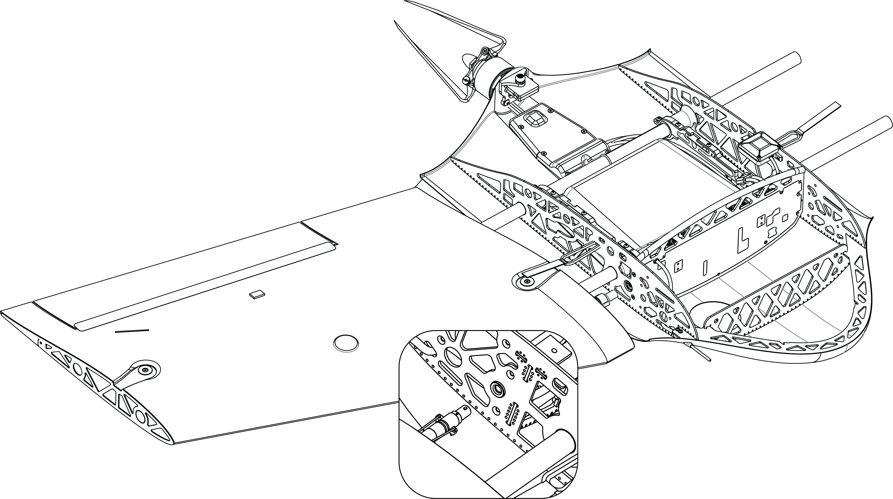

   Place the wing on the mounting rods. Leave a gap between it and fuselage for connector operation, and attach it to the corresponding slots. 

 
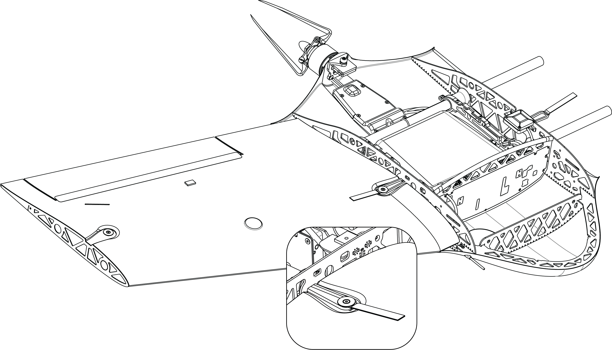

   Move the wing tight to the fuselage and fasten the rubber straps. Do the same on the other side of UAV. 

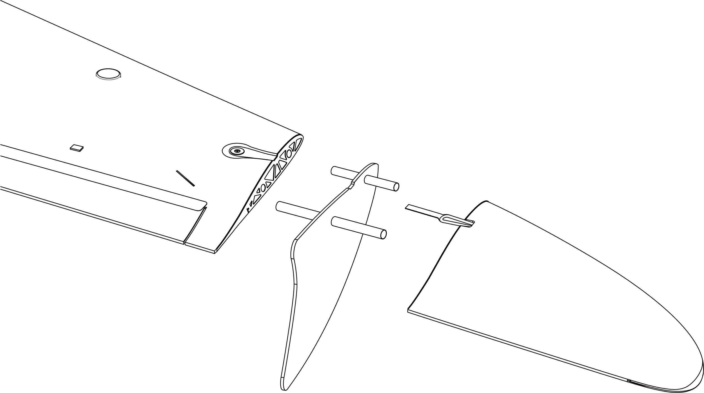

   Insert the leftover rods into the ports at the tip of the wings, as shown in the picture. Attach two fins on them, then the wingtips and move them tight together. Fasten the rubber straps on them.

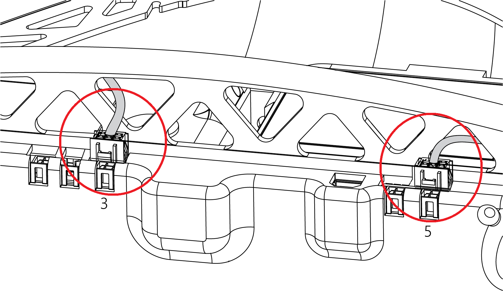

   Place the camera in its slot and secure it with elastic band. Connect it to the UAV as shown in the picture. You can operate the camera (for setting or formatting) without disconnecting it from the UAV.

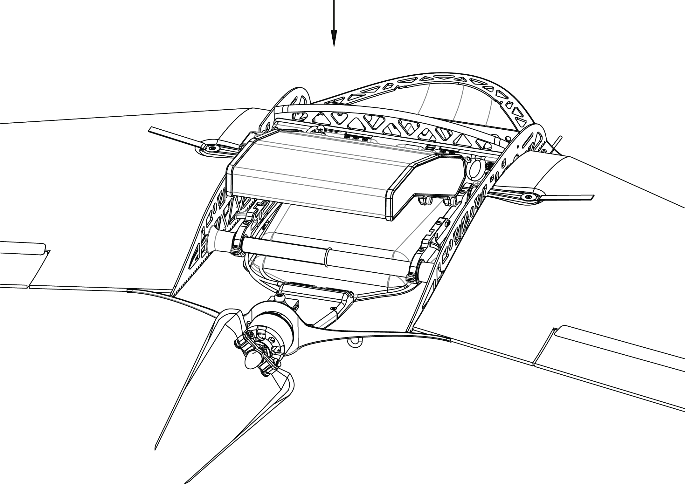

   Install the battery by putting the front catches in the grooves and move the battery forward, then lower it so that rear catches clicks. To extract the battery, push both catches to the sides.

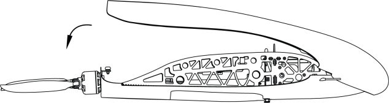

   Close the fuselage lid and make sure it is fixed in place by its catch.

.. attention:: 
 Propeller blades, wing and elevon's surface must not be damaged or covered with any kind of paint, dirt or stickers. Changing the UAV element's balance may cause mid-flight malfunction and damage. 

Parachute system
----------------------

Parachute system's components:
 
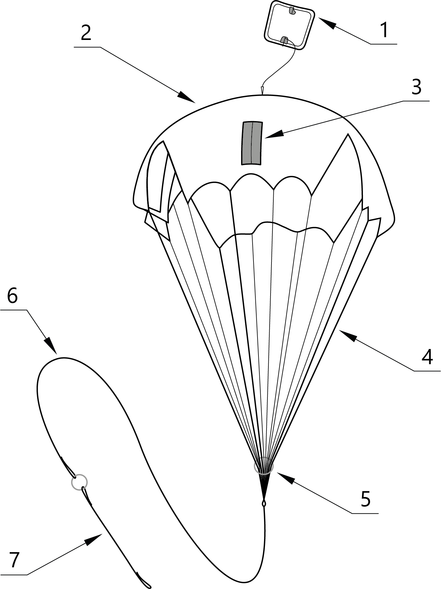

   1 – parachute compartment lid acting as a pull-out parachute; 
   2 – parachute; 
   3 – pockets for the lines; 
   4 – lines; 
   5 – sliding ring to slow the dome opening;
   6 – long static line;
   7 – short static line with the release ring system

.. attention:: Before laying the parachute, make sure that the dome, lines and their attachments to the dome are not damaged. The dome and lines should be dry and clean. Re-pack the parachute if the previous packaging took place more than 10 days ago, or if it was transported by airplane.

**Parachute packing sequence**

1) Check if the parachute is damaged in any way.
2) Make sure the lines are not tangled.
3) In the process of laying the parachute, make sure, that the lines are not tangled.
4) Control the position of the lines pockets. They must remain on the outer side of the folded dome.
5) Straighten the dome and fold it in half, aligning one side with other.

.. figure:: _static/_images/para2.png 
   :align: center
   :width: 300

   Fold the dome in half

.. figure:: _static/_images/para3.png
   :align: center
   :width: 300

   

.. figure:: _static/_images/para4.png
   :align: center
   :width: 300

   As the result, the lines should be collected in 4 bundles with 4 lines in each.

.. figure:: _static/_images/para5.png
   :align: center
   :width: 300

   Fold the dome in half again. The pockets for laying the lines must be outside..
   
 
.. figure:: _static/_images/para6.png
   :align: center
   :width: 300

   Fold the dome as shown in the picture.

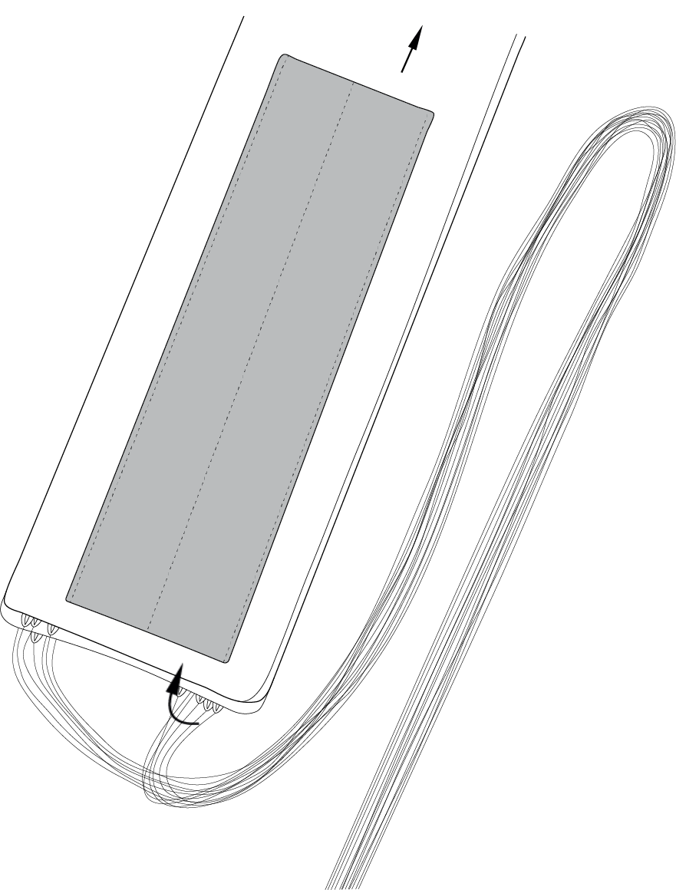

   Make sure that while laying the parachute, the lines haven't get tangled. If necessary, straighten the lines out. 

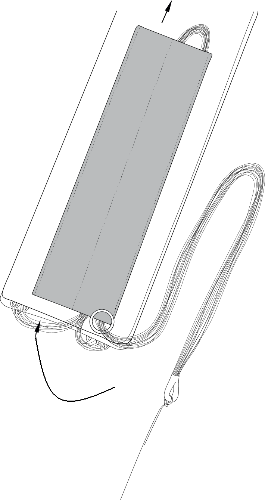

   Fold the lines in half and pull them through the pocket in a way so that the fold would stick out a bit from the opposite side of the pocket.

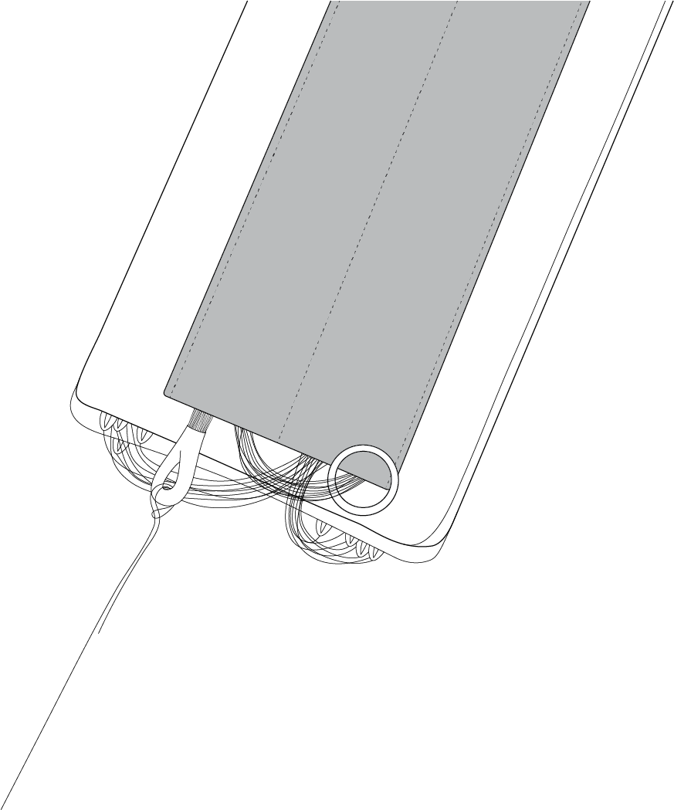

   Get rid of the lines lack near the dome's edge. To do that, pull the line's fold from the opposite side of the bundle. Move the stop ring towards the dome. Fold the leftover lies and tuck them in the empty pocket so that their ends touch the pocket. After that, the ring should be between the line's coils.

.. figure:: _static/_images/para10.png
   :align: center
   :width: 300

   Fold the dome as shown in the picture.

Installing the parachute in the UAV
---------------------------------------

* Turn the UAV upside down so that the parachute compartment is up.
* Pick up a carabiner and straighten the lines.

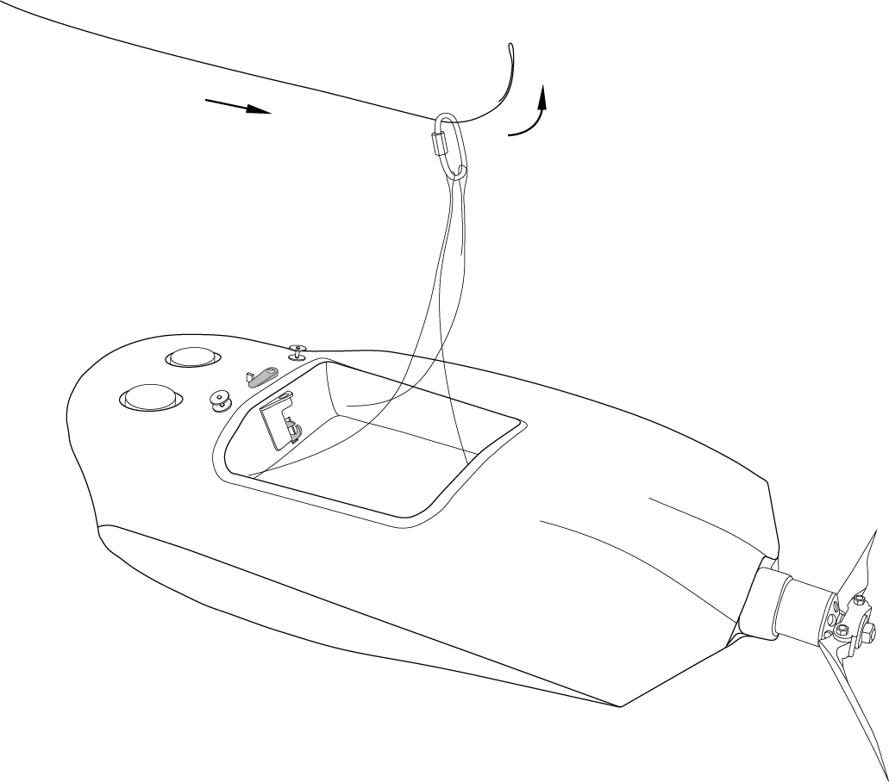

   Put short static line end through the carabiner (as shown in the picture)

    
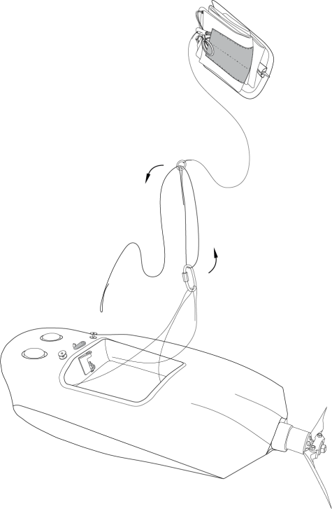

   Put short static line end through release system ring (as shown in the picture). 

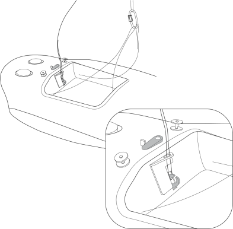

   Put short lanyard end in release system ring and lock the rope between two halfs of the lock.
   Attention! Accidental push of the release system pin may cause the lock to open, which leads to early parachute detachment. 

.. note:: Make sure the release system is securely locked. To do that, hold to the parachute dome and pull it up sharply several times.

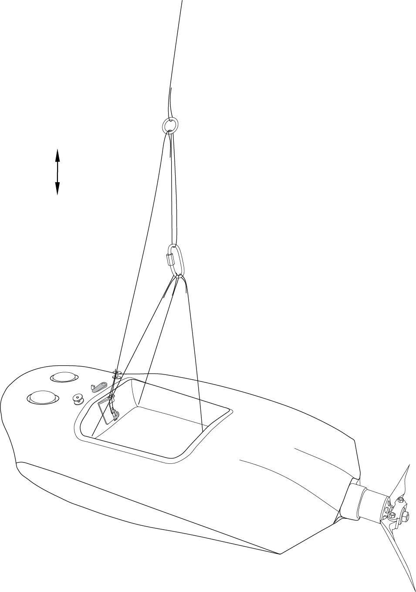

   Carefully fold the parachute system ropes and line on the bottom of compartment. Place the parachute on top so that the locking system ring was on the bottom of the compartment.

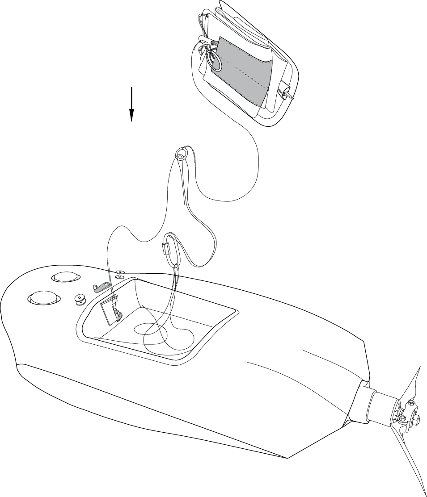

   Put the rear part of parachute compartment cover in the slot and push it in its place. 

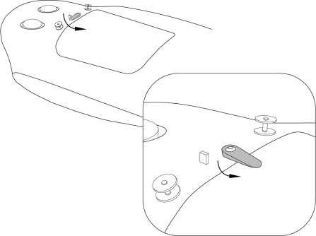

   Press the cover down and turn the locking servo horn to secure it.

Make sure the cover can be opened and closed with no jamming. To do that, turn the locking servo horn sideways and pull the cover up a bit. 
The pull-out line should not be jamed or cling to the cover pin. Make sure the dome does not stick between the cover and the fuselage. Close the cover, push it in and turn the locking servo horn. 

.. attention:: Do not rotate servo horn if UAV power is on.

